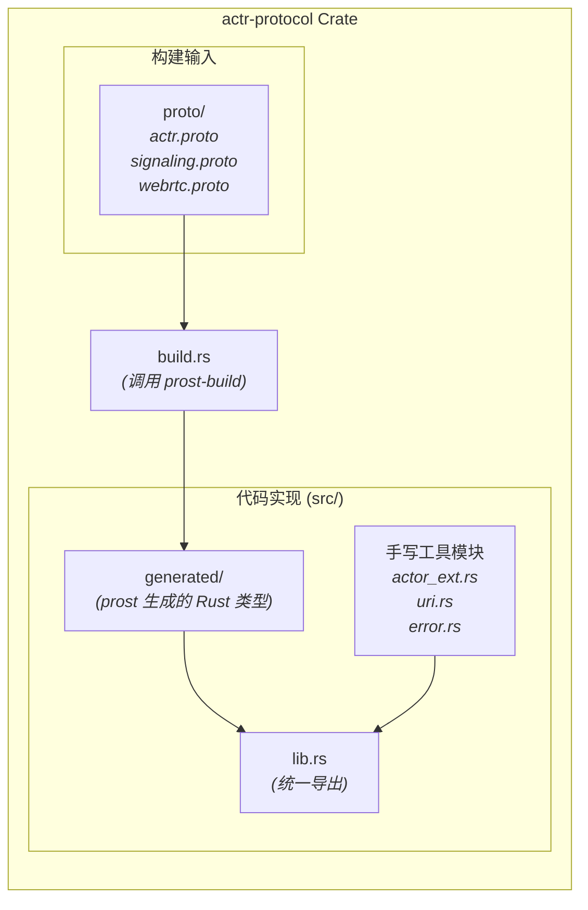
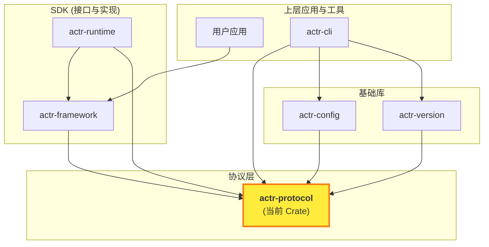

# actr-protocol: Actor-RTC 统一协议基础层

`actr-protocol` 是 Actor-RTC 框架的协议基础层。它定义了构成框架自身运行所需的、标准化的底层通信契约，并提供与这些协议紧密相关的、无状态的工具函数。

## 1. 角色与定位

- **核心职责**:
  1.  **协议定义**: 提供 `.proto` 文件及由其生成的 Rust 类型，涵盖身份、信令、服务发现等框架级概念。
  2.  **基础工具**: 提供对核心类型的必要扩展，如 `ActorId` 的字符串解析/格式化和 `actr://` URI 的处理。

- **清晰边界**: 本模块是纯粹的**数据定义与基础工具层**。它不包含任何高级业务逻辑、运行时实现（如调度器、异步模型）或上层应用框架的 Trait 定义。

## 2. 模块架构

`actr-protocol` 的架构清晰地反映了其职责：将 Protobuf 定义转化为 Rust 代码，并辅以少量无状态的工具模块。



## 3. 核心功能

### 3.1. 协议定义

核心协议被明确划分为三个文件，职责清晰：

- **`webrtc.proto`**: 定义与 WebRTC 标准兼容的基础协商消息 (`IceCandidate`, `SessionDescription`)。
- **`actr.proto`**: 定义框架的核心业务对象，包括身份模型 (`ActrId`, `VTN`)、服务契约 (`ServiceSpec`)、访问控制 (`AclRule`) 和核心交互（`RegisterRequest`, `DiscoveryRequest`）。
- **`signaling.proto`**: 定义所有与信令服务器交互的顶层信封 `SignalingEnvelope`，并组织不同场景下的消息流。

### 3.2. 核心工具与扩展

#### a) Actor ID 扩展 (`actor_ext.rs`)

为 `ActrId` 提供了字符串表示的互相转换能力，格式定义为：`<serial_number>@<realm_id>:<manufacturer>+<name>`。

```rust
use actr_protocol::{ActrId, ActrType, Realm, ActrIdExt};

// 示例
let id = ActrId {
    realm: Realm { realm_id: 101 },
    serial_number: 0x1a2b3c,
    r#type: ActrType {
        manufacturer: "acme".to_string(),
        name: "echo-service".to_string(),
    },
};

let id_str = id.to_string_repr();
assert_eq!(id_str, "1a2b3c@101:acme+echo-service");

let parsed_id = ActrId::from_string_repr(&id_str).unwrap();
assert_eq!(id.serial_number, parsed_id.serial_number);
```

#### b) URI 解析 (`uri.rs`)

提供对 `actr://` 协议 URI 的解析和构建功能，支持 `actr://<realm>:<manufacturer>+<name>@<version>` 格式。

```rust
use std::str::FromStr;
use actr_protocol::uri::{ActrUri, ActrUriBuilder};

// 从字符串解析
let uri = "actr://101:acme+user-service@v1".parse::<ActrUri>().unwrap();
assert_eq!(uri.realm, 101);
assert_eq!(uri.manufacturer, "acme");
assert_eq!(uri.name, "user-service");
assert_eq!(uri.version, "v1");
assert_eq!(uri.actor_type(), "acme+user-service");

// 使用构建器创建
let uri = ActrUriBuilder::new()
    .realm(101)
    .manufacturer("acme")
    .name("user-service")
    .build()
    .unwrap();
assert_eq!(uri.to_string(), "actr://101:acme+user-service@v1");
```

#### c) 错误处理 (`error.rs`)

定义了与本模块职责范围一致的错误类型，如 `AidError` (ID 格式错误) 和 `ActrUriError` (URI 解析错误)。

## 4. 在生态系统中的定位

`actr-protocol` 是整个框架的基石，所有其他 Crate 都直接或间接地依赖它来获取统一的类型定义。



## 5. 开发与构建

当 `proto` 文件发生变更时，`build.rs` 会在构建过程中自动重新生成 `src/generated/` 目录下的 Rust 代码。

```bash
# 清理并重新构建，即可重新生成所有 Protobuf 类型
cargo clean && cargo build -p actr-protocol
```
